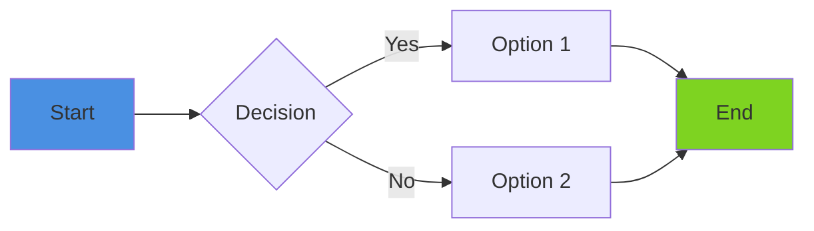

# Infrastructure Diagrams

This directory contains comprehensive visual documentation of the RestoMarket DevOps infrastructure using Mermaid diagrams.

## Available Diagrams

### 1. Infrastructure Topology (`topology.md`)

Shows the complete infrastructure layout for both development and staging environments:

- VPC architecture and networking
- Service components (API, Database, Redis, Load Balancer)
- Firewall configurations
- Monitoring setup
- Resource costs breakdown

**View**: [Infrastructure Topology](./topology.md)

### 2. CI/CD Pipeline (`cicd-pipeline.md`)

Illustrates the complete continuous integration and deployment pipeline:

- Pipeline stages and job dependencies
- Code quality checks and security scanning
- Testing strategy with service containers
- Build and Docker image creation
- Deployment to staging and production
- Caching strategy for optimal performance
- Branch protection rules

**View**: [CI/CD Pipeline Flow](./cicd-pipeline.md)

### 3. Deployment Flow (`deployment-flow.md`)

Details the blue-green deployment strategy:

- Zero-downtime deployment sequence
- Health check validation process
- Automatic rollback mechanism
- Traffic switching procedure
- Deployment methods comparison (GitHub Actions, SSH, Ansible)
- Timeline and performance metrics

**View**: [Deployment Flow](./deployment-flow.md)

### 4. Network Security (`network-security.md`)

Comprehensive security architecture documentation:

- Security zones and boundaries
- Firewall rules for each component
- UFW and Fail2ban configuration
- SSH hardening measures
- SSL/TLS implementation
- Defense-in-depth layers
- Attack surface minimization
- Security monitoring and alerts

**View**: [Network Security Architecture](./network-security.md)

## Viewing the Diagrams

### GitHub / GitLab

These Mermaid diagrams render automatically on GitHub and GitLab when viewing the `.md` files directly in the repository.

### VS Code

Install the "Markdown Preview Mermaid Support" extension to view diagrams in VS Code:

```bash
code --install-extension bierner.markdown-mermaid
```

### Other Viewers

- **Mermaid Live Editor**: https://mermaid.live/
  - Copy diagram code and paste into the editor
- **Documentation Sites**: Most modern documentation generators (Docusaurus, VuePress, etc.) support Mermaid

## Diagram Types Used

| Type              | Purpose                    | Examples                       |
| ----------------- | -------------------------- | ------------------------------ |
| `graph TB/LR`     | Hierarchical relationships | Infrastructure topology        |
| `sequenceDiagram` | Time-based interactions    | Deployment sequence            |
| `flowchart TD`    | Decision flows             | Deployment decisions, rollback |
| `stateDiagram-v2` | State machines             | Health check states            |
| `timeline`        | Chronological events       | Deployment timeline            |

## Editing Diagrams

All diagrams are written in Mermaid syntax, a Markdown-inspired text notation for creating diagrams.

### Mermaid Resources

- **Official Documentation**: https://mermaid.js.org/
- **Syntax Guide**: https://mermaid.js.org/intro/
- **Live Editor**: https://mermaid.live/
- **Examples**: https://github.com/mermaid-js/mermaid/tree/develop/packages/mermaid/src/docs

### Common Mermaid Syntax



### Style Colors Used

Our diagrams use a consistent color scheme:

- **Blue** `#4A90E2`: Primary components (LB, start/end)
- **Green** `#7ED321`: Healthy/success states (API servers, pass)
- **Orange** `#F5A623`: Warnings/attention (database, build)
- **Purple** `#BD10E0`: Special/monitoring (monitoring, Docker)
- **Red** `#D0021B`: Errors/blocks (firewalls, failures)
- **Teal** `#50E3C2`: Staging/alternate (staging deploy)

## Exporting Diagrams

### To PNG/SVG

1. Open the diagram in Mermaid Live Editor: https://mermaid.live/
2. Copy the Mermaid code from the `.md` file
3. Paste into the editor
4. Click "Actions" → "Export PNG/SVG"

### To PDF

1. Export as SVG first
2. Use a tool like Inkscape or browser print to convert to PDF

### Command Line (with mermaid-cli)

```bash
# Install mermaid-cli
npm install -g @mermaid-js/mermaid-cli

# Export diagram
mmdc -i topology.md -o topology.png -t dark -b transparent
```

## Integration with Documentation

These diagrams are referenced in:

- `infrastructure/README.md` - Main infrastructure documentation
- `infrastructure/docs/deployment-runbook.md` - Operational procedures
- Individual environment READMEs (dev, staging)

## Updating Diagrams

When infrastructure changes:

1. Update the relevant diagram files in this directory
2. Verify diagrams render correctly in GitHub preview
3. Update references in documentation if needed
4. Commit changes with descriptive message:
   ```
   docs(root): update infrastructure topology diagram
   - Add new monitoring alert component
   - Update firewall rules
   ```

## Questions or Issues

If diagrams are not rendering or need updates, please:

1. Check Mermaid syntax at https://mermaid.live/
2. Verify the diagram file is valid Markdown
3. Open an issue with details about the rendering problem
