# CI/CD Pipeline Flow Diagram

## Complete Pipeline Overview

```mermaid
graph LR
    subgraph "Trigger Events"
        PR[Pull Request<br/>to main/develop]
        PUSH_DEV[Push to<br/>develop]
        PUSH_MAIN[Push to<br/>main]
    end

    subgraph "Stage 1: Code Quality"
        CQ[Code Quality Job<br/>- Checkout<br/>- pnpm install<br/>- Lint<br/>- Format check<br/>- Type check<br/>- Dependency audit<br/>- Gitleaks scan<br/>- Trivy FS scan<br/>- Upload SARIF]
    end

    subgraph "Stage 2: Testing"
        TEST[Test Job<br/>- Checkout<br/>- pnpm install<br/>- Unit tests<br/>- Integration tests<br/>- E2E tests<br/>- Generate coverage<br/>- Upload to Codecov<br/>Service Containers:<br/>PostgreSQL 15, Redis 7]
    end

    subgraph "Stage 3: Build"
        BUILD[Build Job<br/>- Checkout<br/>- pnpm install<br/>- Build all packages<br/>- Upload artifacts:<br/>  • API<br/>  • Web<br/>  • Packages]
    end

    subgraph "Stage 4: Docker"
        DOCKER[Docker Build Job<br/>Only on push<br/>- Setup Buildx<br/>- Login to GHCR<br/>- Build & push image<br/>- Tag: sha-*, branch<br/>- Trivy image scan<br/>- Upload SARIF]
    end

    subgraph "Stage 5a: Deploy Staging"
        DEPLOY_STG[Deploy Staging Job<br/>Only on develop<br/>- SSH to droplet<br/>- Pull new image<br/>- Blue-green deploy<br/>- Health check<br/>- Smoke tests<br/>- Rollback on failure<br/>- Notify Slack]
    end

    subgraph "Stage 5b: Deploy Production"
        DEPLOY_PROD[Deploy Production Job<br/>Only on main<br/>- Manual approval<br/>- Backup database<br/>- Blue-green deploy<br/>- Health check<br/>- Smoke tests<br/>- Create Sentry release<br/>- Notify Slack]
    end

    PR --> CQ
    PUSH_DEV --> CQ
    PUSH_MAIN --> CQ

    CQ -->|Pass| TEST
    TEST -->|Pass| BUILD
    BUILD -->|Pass| DOCKER

    DOCKER -->|develop| DEPLOY_STG
    DOCKER -->|main| DEPLOY_PROD

    style CQ fill:#4A90E2,stroke:#2E5C8A,color:#fff
    style TEST fill:#7ED321,stroke:#5FA019,color:#000
    style BUILD fill:#F5A623,stroke:#C77E1A,color:#000
    style DOCKER fill:#BD10E0,stroke:#8B0AA8,color:#fff
    style DEPLOY_STG fill:#50E3C2,stroke:#3AB09E,color:#000
    style DEPLOY_PROD fill:#FF6B6B,stroke:#C54545,color:#fff
```



## Detailed Job Dependencies


## Caching Strategy


## Security Scanning Points

```mermaid
graph LR
    subgraph "Code Quality Stage"
        GL[Gitleaks<br/>Secret Detection]
        TRIVY_FS[Trivy<br/>Filesystem Scan<br/>Dependencies]
        AUDIT[pnpm audit<br/>Dependency Vulnerabilities]
    end

    subgraph "Docker Stage"
        TRIVY_IMG[Trivy<br/>Image Scan<br/>Container Vulnerabilities]
    end

    subgraph "Results"
        SARIF[GitHub Security Tab<br/>SARIF Reports]
        BLOCK{Block Pipeline?}
    end

    GL --> SARIF
    TRIVY_FS --> SARIF
    AUDIT --> SARIF
    TRIVY_IMG --> SARIF

    SARIF --> BLOCK
    BLOCK -->|Critical/High| FAIL[❌ Pipeline Fails]
    BLOCK -->|None/Low/Medium| PASS[✅ Pipeline Continues]

    style GL fill:#D0021B,stroke:#9B0114,color:#fff
    style TRIVY_FS fill:#D0021B,stroke:#9B0114,color:#fff
    style AUDIT fill:#F5A623,stroke:#C77E1A,color:#000
    style TRIVY_IMG fill:#D0021B,stroke:#9B0114,color:#fff
    style FAIL fill:#D0021B,stroke:#9B0114,color:#fff
    style PASS fill:#7ED321,stroke:#5FA019,color:#000
```



## Performance Targets

| Stage            | Target Time       | With Cache        |
| ---------------- | ----------------- | ----------------- |
| Code Quality     | 5 minutes         | 2 minutes         |
| Test             | 10 minutes        | 5 minutes         |
| Build            | 5 minutes         | 2 minutes         |
| Docker Build     | 10 minutes        | 3 minutes         |
| Deploy Staging   | 5 minutes         | N/A               |
| **Total PR**     | **15-20 minutes** | **7-10 minutes**  |
| **Total Deploy** | **30-35 minutes** | **15-20 minutes** |

## Branch Protection Rules

```mermaid
graph TD
    PR[Pull Request] --> CHECKS{Required Checks}

    CHECKS --> CQ_CHECK[✓ code-quality]
    CHECKS --> TEST_CHECK[✓ test]
    CHECKS --> BUILD_CHECK[✓ build]

    CQ_CHECK --> APPROVAL{Approval Required?}
    TEST_CHECK --> APPROVAL
    BUILD_CHECK --> APPROVAL

    APPROVAL -->|main: 1 approval| MERGE[✅ Merge Allowed]
    APPROVAL -->|develop: optional| MERGE

    MERGE --> AUTO_DEPLOY{Auto Deploy?}
    AUTO_DEPLOY -->|develop → staging| YES[✅ Auto Deploy]
    AUTO_DEPLOY -->|main → production| MANUAL[🔐 Manual Approval]

    style CHECKS fill:#4A90E2,stroke:#2E5C8A,color:#fff
    style MERGE fill:#7ED321,stroke:#5FA019,color:#000
    style YES fill:#7ED321,stroke:#5FA019,color:#000
    style MANUAL fill:#F5A623,stroke:#C77E1A,color:#000
```



## Turborepo Filters

The CI/CD pipeline uses Turborepo filters to optimize build times by only running tasks for changed packages:

```bash
# Only lint/test/build packages that changed since base branch
turbo run lint test build --filter=...[origin/${{ github.base_ref || 'main' }}]
```

This means:

- Pull requests only test what changed
- Full repository builds only on merge to main/develop
- Faster feedback for developers (minutes vs tens of minutes)
