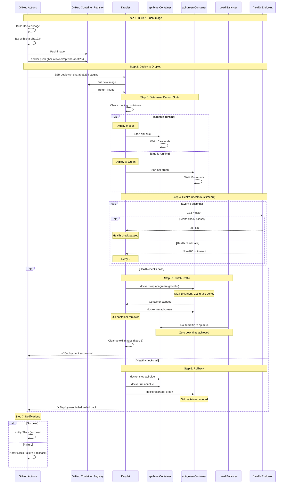
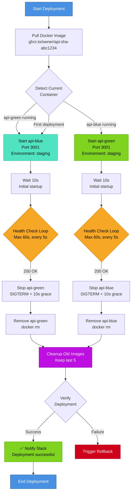
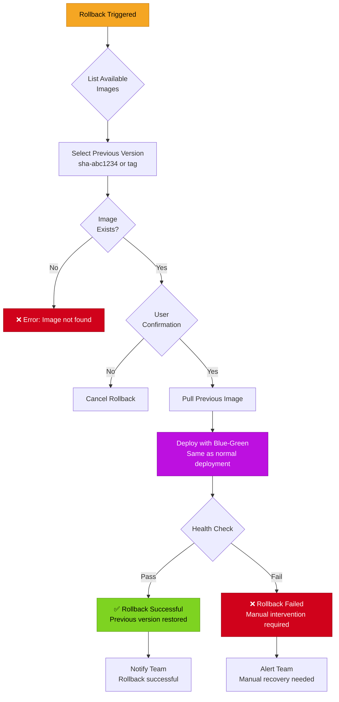
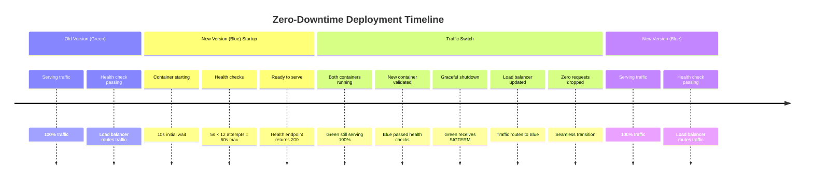
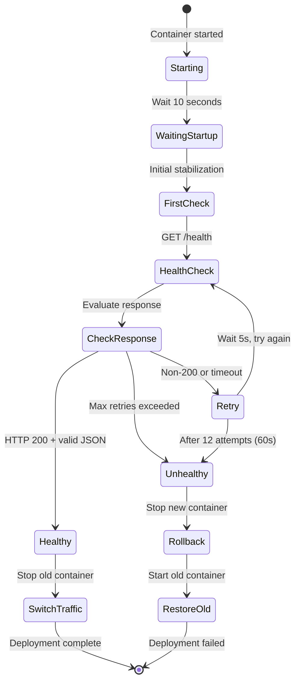
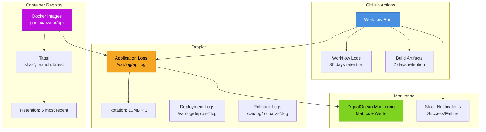

# Deployment Flow Diagram

## Blue-Green Deployment Strategy

## Normal Deployment Flow (Success Path)

## Rollback Flow

## Deployment Methods Comparison

```mermaid
graph TB
    subgraph "Method 1: GitHub Actions (Recommended)"
        M1_START[Push to develop/main] --> M1_CI[CI/CD Pipeline<br/>All quality checks]
        M1_CI --> M1_BUILD[Build & Push Image]
        M1_BUILD --> M1_DEPLOY[Auto Deploy via SSH]
        M1_DEPLOY --> M1_HEALTH[Health Check]
        M1_HEALTH -->|Pass| M1_SUCCESS[✅ Success]
        M1_HEALTH -->|Fail| M1_ROLLBACK[Auto Rollback]
    end

    subgraph "Method 2: Manual SSH"
        M2_START[SSH to droplet] --> M2_PULL[Pull image manually]
        M2_PULL --> M2_SCRIPT[Run deploy.sh]
        M2_SCRIPT --> M2_HEALTH[Health Check]
        M2_HEALTH -->|Pass| M2_SUCCESS[✅ Success]
        M2_HEALTH -->|Fail| M2_MANUAL_RB[Manual Rollback]
    end

    subgraph "Method 3: Ansible"
        M3_START[Local Machine] --> M3_PLAYBOOK[ansible-playbook<br/>update-api.yml]
        M3_PLAYBOOK --> M3_TASKS[Ansible Tasks<br/>Pull + Deploy + Health]
        M3_TASKS --> M3_HEALTH[Health Check]
        M3_HEALTH -->|Pass| M3_SUCCESS[✅ Success]
        M3_HEALTH -->|Fail| M3_AUTO_RB[Auto Rollback]
    end

    style M1_SUCCESS fill:#7ED321,stroke:#5FA019,color:#000
    style M2_SUCCESS fill:#7ED321,stroke:#5FA019,color:#000
    style M3_SUCCESS fill:#7ED321,stroke:#5FA019,color:#000
    style M1_ROLLBACK fill:#F5A623,stroke:#C77E1A,color:#000
    style M2_MANUAL_RB fill:#D0021B,stroke:#9B0114,color:#fff
    style M3_AUTO_RB fill:#F5A623,stroke:#C77E1A,color:#000
```

## Zero-Downtime Guarantee

## Health Check Flow

## Deployment Artifacts & Logs

## Deployment Time Breakdown

| Phase                   | Time           | Cumulative        |
| ----------------------- | -------------- | ----------------- |
| Pull Docker image       | 30-60s         | 0:30-1:00         |
| Start new container     | 10s            | 0:40-1:10         |
| Health checks (typical) | 15-20s         | 1:00-1:30         |
| Stop old container      | 10s            | 1:10-1:40         |
| Cleanup                 | 5-10s          | 1:15-1:50         |
| **Total**               | **~2 minutes** | **Success path**  |
| Rollback (if needed)    | +1-2 minutes   | **Recovery time** |
