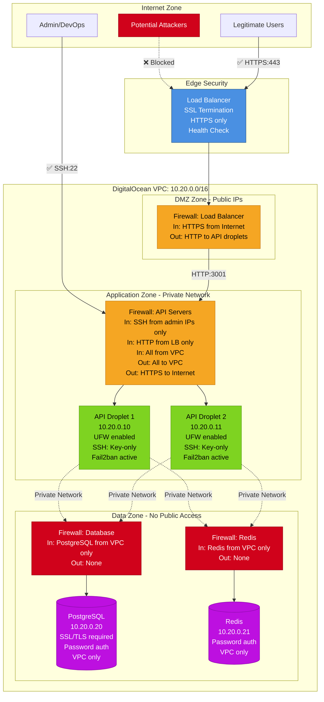
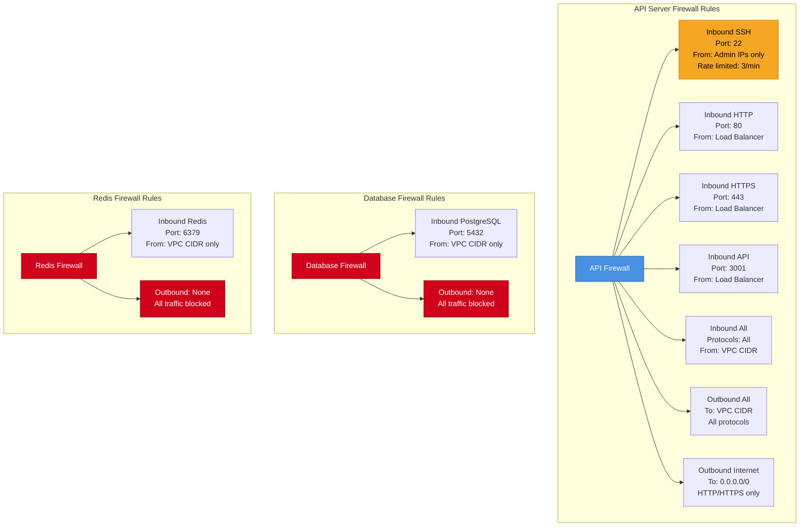
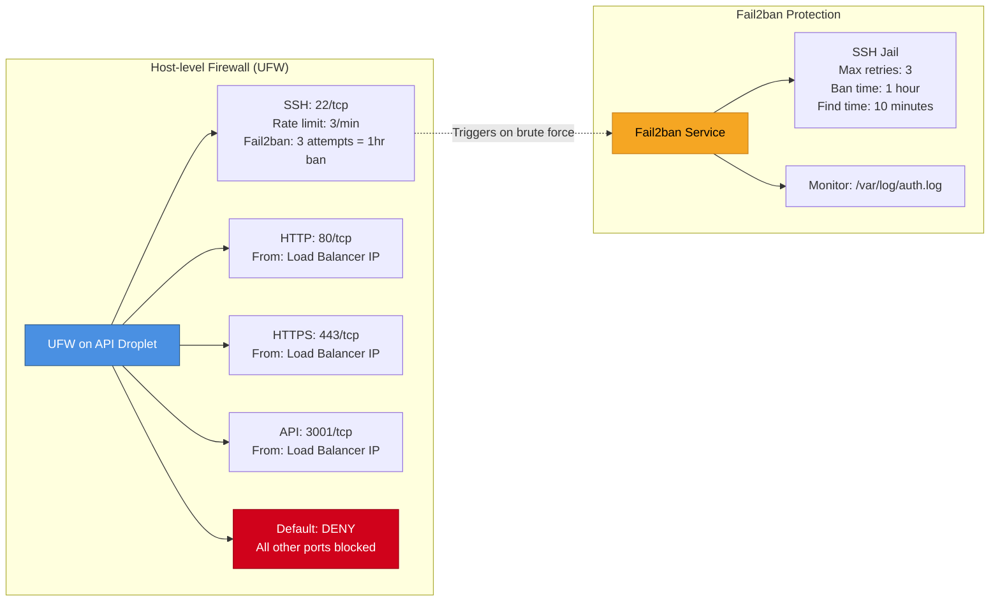
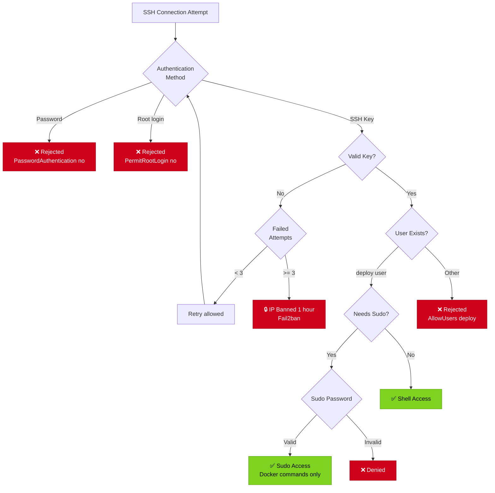
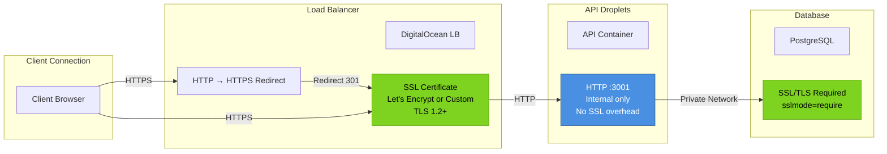
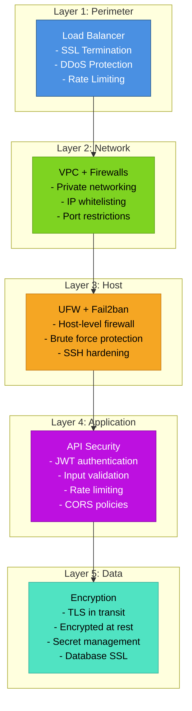
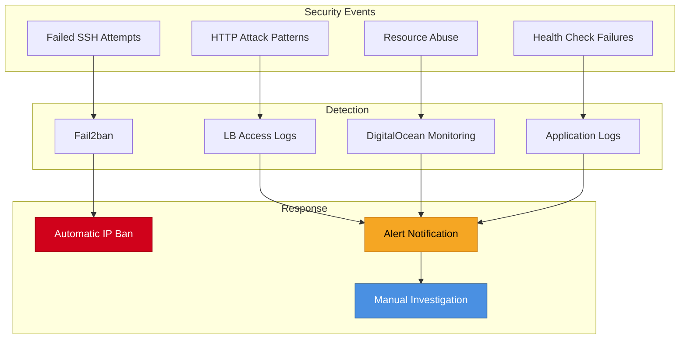

# Network Security Diagram

## Staging Environment Security Architecture

## Firewall Rules Detail

## UFW (Uncomplicated Firewall) on Droplets

## SSH Security Hardening

## SSL/TLS Configuration

## Security Layers Summary

## Attack Surface Minimization

| Component     | Public Access  | Authentication | Encryption            | Firewall           |
| ------------- | -------------- | -------------- | --------------------- | ------------------ |
| Load Balancer | ✅ HTTPS only  | N/A            | TLS 1.2+              | DigitalOcean       |
| API Droplets  | ❌ Via LB only | JWT tokens     | TLS to LB             | DigitalOcean + UFW |
| Database      | ❌ VPC only    | Password       | SSL/TLS               | DigitalOcean       |
| Redis         | ❌ VPC only    | Password       | N/A (trusted network) | DigitalOcean       |
| SSH Access    | ⚠️ Admin IPs   | SSH keys       | SSH protocol          | UFW + Fail2ban     |

## Security Monitoring & Alerts

## Compliance & Best Practices

- ✅ **Principle of Least Privilege**: Services have minimal required permissions
- ✅ **Defense in Depth**: Multiple security layers
- ✅ **Network Segmentation**: VPC isolates resources
- ✅ **Encryption in Transit**: TLS for all external connections
- ✅ **SSH Hardening**: Key-only, no root, rate limiting
- ✅ **Secret Management**: No secrets in code or containers
- ✅ **Automated Updates**: Security patches applied automatically
- ✅ **Monitoring & Alerting**: Real-time security event detection
- ✅ **Audit Logging**: All access attempts logged
- ✅ **Incident Response**: Documented procedures in runbook
