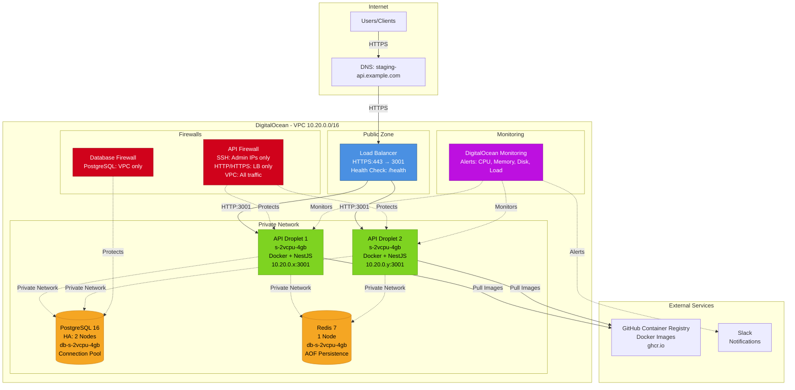
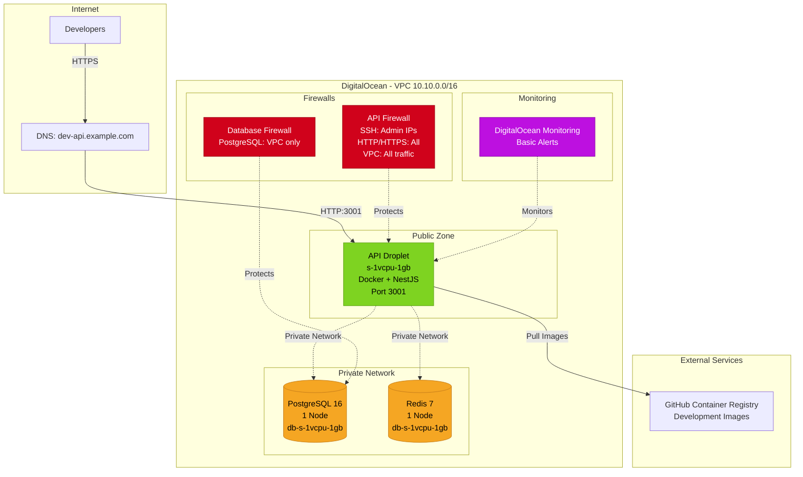

# Infrastructure Topology Diagram

## Staging Environment Architecture

## Development Environment Architecture

## Resource Costs

### Staging Environment (~$245/month)

- API Droplets: 2 × $24 = $48
- Database (HA): 2 × $60 = $120
- Redis: $60
- Load Balancer: $12
- Backups: ~$10
- Bandwidth: ~$5

### Development Environment (~$36/month)

- API Droplet: $6
- Database: $15
- Redis: $15
- Bandwidth: minimal

## Network Security

- **VPC Isolation**: All services communicate over private network
- **Firewall Rules**:
  - SSH access restricted to admin IPs only
  - API accessible only through load balancer (staging) or direct (dev)
  - Database/Redis accessible only from VPC
- **SSL/TLS**: All external connections encrypted
- **Health Checks**: Automatic unhealthy instance removal
